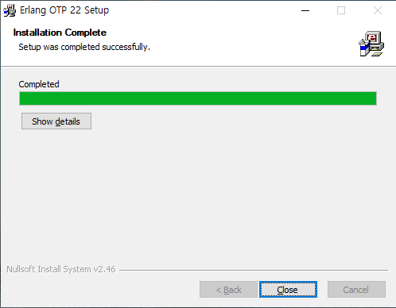
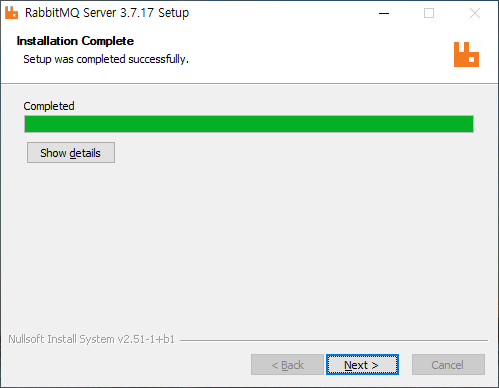
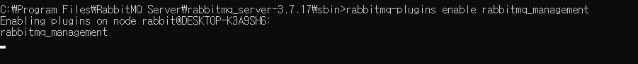
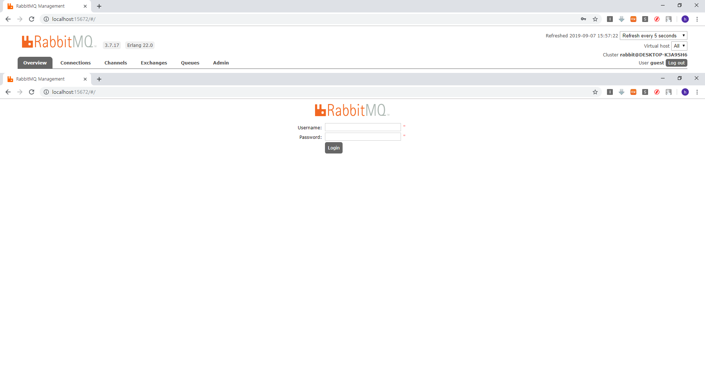
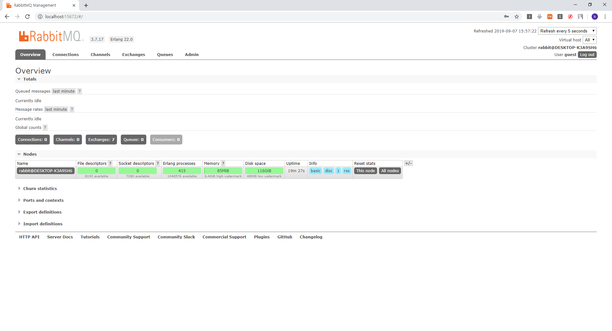

# Rabbitmq

### Rabbitmq windows 환경에 설치

Rabbitmq를 설치하기 전에  ERLANG OTP를 설치한다.<br>

Link : https://www.erlang.org/downloads<br>

<br>

나는 OTP22 버전을 인스톨 했다.<br>

OPT설치후 아래 링크에서 rabbitmq window용을 다운받아 설치를 한다<br>

Link : https://www.rabbitmq.com/download.html <br>

<br>

rabbitmq 설치 후 cmd창을 열고 다음 커맨드를 입력한다.<br>

```
 rabbitmq-plugins enable rabbitmq_management
```

<br>

rabbitmq 모니터링하기 위한 management plugin을 허용후 재시작 한다 <br>
```
 rabbitmq-service.bat stop
 rabbitmq-service.bat install
 rabbitmq-service.bat start
```

재시작후 Link: http://localhost:15672 로 접속후 

<br>

ID:guest / PW:guest로 로그인을 한다.<br>

<br>

여기까지 오면 설치 완료!


