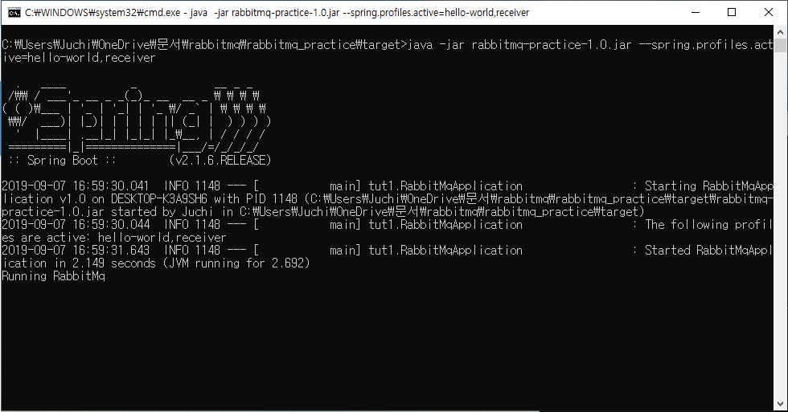

# Rabbitmq

### Rabbitmq sender,receiver 테스트


해당 프로젝트를 package로 만들고 jar 파일을 구동해보자.<br>

```
java -jar rabbitmq-practice-1.0.jar --spring.profiles.active=hello-world,receiver
```
receiver를 먼저 실행한후<br>

<br>

------
```
java -jar rabbitmq-practice-1.0.jar --spring.profiles.active=hello-world,sender
``` 
sender를 실행한다<br>

<br>


sender를 실행한 후 receiver를 확인하면 메세지가 온것을 확인할수 있다.


<br>


